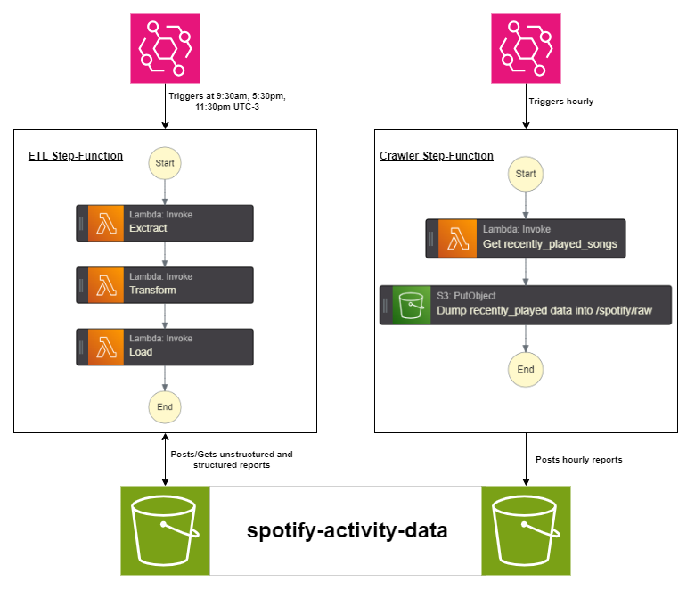

# Music Activity Data ETL

## ETL to keep record of my music activity from Spotify. Main goals of this project:
- Practice and learn about data engineering tools such as Airflow and AWS services related to this field.
- Monitor and visualize my music data.

## Things that came across the way
I realised that the Spotify endpoint to get [recently_played songs](https://developer.spotify.com/documentation/web-api/reference/get-recently-played) only gives the latest 50 songs, but doesn't let you go any further in time. This was not ideal, since I listen to way more than 50 songs in a single day.

## Solution
Reading about AWS services, I came across AWS: Step Functions.

Since the Spotify endpoint as it is doesn't really do what I want (get all my played songs), I decided to do two things:
- Setup an AWS: Step Function to trigger a Lambda function every 1 hour in order to get all my played songs and periodically dump them in a S3 bucket.
- Since my ETL is simple, I decided to make another Step Function to run it, composed of 3 Lambdas, one for each main function, **Extract**, **Transform** and **Load**. This Step Function runs daily.

So my project architecture looks like this:



## Data being tracked
The data being tracked can be divided into two main groups. The song general data and the sections data.
### Song General Data
This data represents general information about a song. Here are the features used here:
- **track_id**: ID of the track from Spotify's API.
- **track_name**: Title of the track.
- **track_artist**: Artist of the track.
-  **played_at**: Time at which the song was played.
-  **explicit**: Shows if the track has explicit lyrics or not.
-  **popularity**: Track popularity according to Spotify.
-  **album**: Name of the album the track belongs to.
-  **album_cover**: URL to the album's cover.
-  **album_cover_height**: Cover's height.
-  **album_cover_width**: Cover's width.
-  **duration**: Duration of the track in seconds.

The following data comes from the [Track's Audio Features](https://developer.spotify.com/documentation/web-api/reference/get-several-audio-features) endpoint, for more detail on each attribute, view the endpoint's documentation.

-  **loudness**: Overall loudness of the track in decibels.
-  **tempo**: Overall tempo of the track in beats per minute.
-  **key**: The key the track is in.
-  **time_signature**: Estimated time signature.
-  **mode**: The mode indicates the modality of the track (major or minor).
-  **acousticness**: Confidence value of wether the track is acoustic.
-  **danceability**: Describes how suitable the track is for dancing.
-  **energy**: Represents a perceptual measure of intensity and activity.
-  **instrumentalness**: Predicts whether a track contains no vocals.
-  **speechiness**: Detects the presence of spoken words in the track.
-  **valence**: Describes the musical positiveness conveyed by the track.

This features are calculated.
- **sections**: The number of sections the track is divided in.
- **sections_duration_avg**: The average duration of each section of the track.
- **loudness_avg**: The average loudness of the sections in the track.
- **tempo_avg**: The average tempo of the sections in the track.

### Sections data
According to Spotify: *Sections are defined by large variations in rhythm or timbre, e.g. chorus, verse, bridge, guitar solo, etc. Each section contains its own descriptions of tempo, key, mode, time_signature, and loudness.* This data is obtained from the [Track's Audio Analysis](https://developer.spotify.com/documentation/web-api/reference/get-audio-analysis) endpoint.

Since a song can have many sections, instead of representing them in an array of objects (like Spotify's API), they're represented in sequences of values.

- **start_sequence**: Contains the seconds at where each section starts.
- **loudness_sequence**: Contains the loudness of each section.
- **tempo_sequence**: Contains the tempo of each section.
- **key_sequence**: Contains the key of each section.
- **mode_sequence**: Contains the mode of seach section.
- **time_signature_sequence**: Contains the time signature of each section.

### Here's how the data for a single song looks at the end of the ETL.

```json
{
   "track_id":"7LSpFCvRZZot2AlmkUzy9k",
   "track_name":"SIRENS",
   "track_artist":"Travis Scott",
   "played_at":"2023-11-28 11:40",
   "explicit":true,
   "popularity":77,
   "album":"UTOPIA",
   "album_cover":"https:\/\/i.scdn.co\/image\/ab67616d0000b273881d8d8378cd01099babcd44",
   "album_cover_height":640,
   "album_cover_width":640,
   "duration":204.4473,
   "loudness":-6.117,
   "tempo":96.003,
   "key":9,
   "time_signature":3,
   "mode":0,
   "acousticness":0.0976,
   "danceability":0.588,
   "energy":0.88,
   "instrumentalness":0.000167,
   "speechiness":0.0747,
   "valence":0.242,
   "sections":9,
   "section_duration_avg":22.72,
   "loudness_avg":-7.21,
   "tempo_avg":95.66,
   "start_sequence":[0.0,25.8771,61.58935,78.49172,94.13155,142.6858,153.51543,169.3769,185.09818],
   "loudness_sequence":[-16.568,-6.653,-5.532,-5.096,-5.193,-4.658,-2.569,-7.718,-10.89],
   "tempo_sequence":[96.819,96.11,95.934,95.919,96.05,93.908,94.623,96.033,95.551],
   "key_sequence":[9,9,0,8,9,9,9,2,7],
   "mode_sequence":[0,0,1,1,0,0,0,1,0],
   "time_signature_sequence":[3,3,3,3,3,3,3,3,3]
}
```
## Data that could be added
- The **genre** of the song is a feature that is very useful and I'm actually not getting from the tracks.
- The **segments** of the track. Just like Sections, tracks are divided in Segments. According to Spotify: *Each segment contains a roughly conisistent sound throughout its duration.*

## Visualization
The visualization is not done yet. I'm planning on showcasing it on my personal website, which is in development right now. 

**Planned Features**:

- **Daily Music Insights**: A unique calendar view, where each day is represented by the album cover of my most-listened-to song of that day.
- **Annual Listening Summary**: A compilation of my total listening time over the year.

**Future Possibilities**: The dataset created from this ETL offers extensive potential for additional visualizations and analyses. However, the current focus is on the features just described.

## What I Learned
- Got a lot more familiar with the whole AWS ecosystem.
- Learned about CI/CD (Github Actions workflows).
- Integrated my CI/CD to my AWS resources (Lambda Functions), which was pretty cool and simple.
- Discovered the Step-Functions service, which I found very interesting and powerful. I'd like to dig deeper in how to create and deploy them as code instead of doing it by hand with the web interface (similar to what I did with my Lambdas and my CI/CD).

## Pivoting
The original idea of this project was to use the song characteristics I mentioned earlier, and by a hand-made dataset of similar songs, train a machine learning model that could decide if two songs sounded similar or not. This could be used in the future once this whole thing is working and I gather enough data, but I decided moving into simpler things (I believe) and go with this ETL idea.